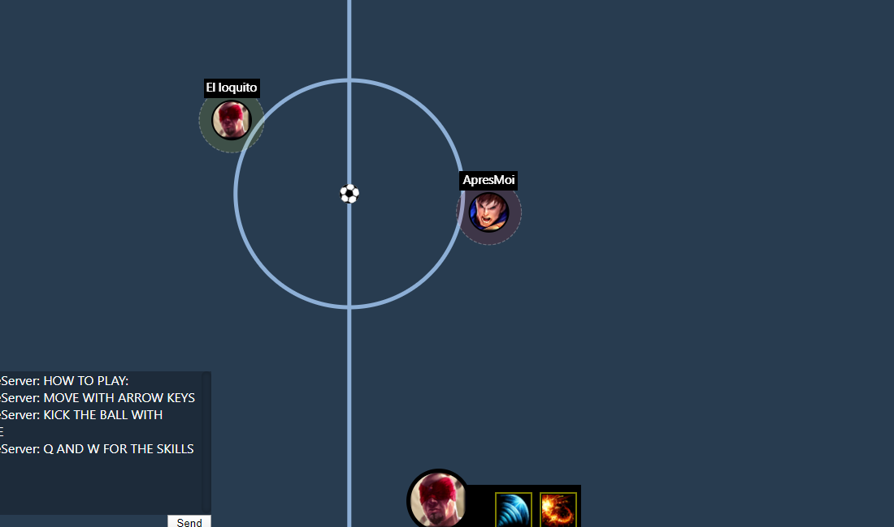

<p align="center">
  
</p>

<h1 align="center">Footlol</h1>

<p align="center">
  <strong>Real-time multiplayer football arena with champion abilities</strong>
</p>

<p align="center">
  <a href="https://footlol.com">Play Now</a>&nbsp;&nbsp;&bull;&nbsp;&nbsp;<a href="#quick-start">Quick Start</a>&nbsp;&nbsp;&bull;&nbsp;&nbsp;<a href="CONTRIBUTING.md">Contributing</a>
</p>

<p align="center">
  
</p>

---

Footlol is a browser-based multiplayer football game where players join rooms, pick teams, select champions with unique abilities, and compete in fast-paced physics-driven matches. Built during the pandemic, open-sourced with love.

## Features

- **Real-time multiplayer** &mdash; Server-authoritative 40 Hz physics loop via Socket.IO
- **Champion abilities** &mdash; League of Legends-inspired champions with Q and W skills
- **Room system** &mdash; Create/join rooms, pick teams, ready up
- **Mobile support** &mdash; Touch joystick and action buttons for phones and tablets
- **Configurable matches** &mdash; Admins set match duration and team size from the lobby
- **In-game chat** &mdash; Talk with your teammates and opponents during matches

## Tech Stack

| Layer | Tech |
|-------|------|
| Frontend | React 19, Vite, TypeScript, SCSS |
| Backend | Node.js, Express, Socket.IO, Matter.js, TypeScript |
| Edge | Caddy (TLS termination, reverse proxy, compression) |
| Static | Nginx (production client serving) |
| Infra | Docker Compose, AWS EC2 |

## Architecture

```
Browser  <-->  Caddy (TLS, gzip)  <-->  Nginx (static)
                                   <-->  Express + Socket.IO (game server)
```

- Client is a React SPA served by Nginx in production
- Game server runs a 40 Hz physics loop with Matter.js
- Communication via Socket.IO with binary-encoded JSON
- Each room is a Socket.IO namespace

## Repository Structure

```
footlol/
├── client/                   # React + Vite web client
│   ├── src/
│   │   ├── views/            # Game screens (Login, Rooms, TeamSelect, World)
│   │   ├── store/            # State management + socket layer
│   │   └── utils/            # Shared utilities
│   └── public/               # Static assets
├── server/                   # Express + Socket.IO game server
│   └── src/
│       ├── classes/           # Game logic (Field, Room, Champions)
│       │   └── collideables/  # Physics bodies (Ball, Player, Wall, Goal)
│       └── index.ts           # Entry point + REST API
├── ops/                       # Caddy configuration
├── docker-compose.dev.yml     # Local development stack
└── docker-compose.ec2.yml     # Production stack
```

## Quick Start

### With Docker (recommended)

```bash
docker compose -f docker-compose.dev.yml up -d --build
```

| Service | URL |
|---------|-----|
| Client | http://localhost:5000 |
| Server API | http://localhost:5001 |

```bash
docker compose -f docker-compose.dev.yml down   # stop
```

### Without Docker

```bash
# Terminal 1 — Client
cd client && npm ci && npm run dev

# Terminal 2 — Server
cd server && npm ci && npm run start-dev
```

## Controls

### Desktop

| Key | Action |
|-----|--------|
| Arrow keys | Move |
| Space | Kick |
| Q | Ability 1 |
| W | Ability 2 |
| Tab | Scoreboard |

### Mobile

Rotate to landscape. Virtual joystick on the left, action buttons on the right.

## Environment Variables

| Variable | Where | Purpose |
|----------|-------|---------|
| `DOMAIN` | Edge (Caddy) | Production domain for TLS (default: `localhost`) |
| `NODE_ENV` | Server | `development` or `production` |
| `PORT` | Server | Express listen port (default: `3000`) |
| `VITE_SITE_URL` | Client build | Canonical site URL |
| `VITE_GA_MEASUREMENT_ID` | Client build | Google Analytics 4 ID |

## API

| Method | Endpoint | Description |
|--------|----------|-------------|
| `GET` | `/api/rooms` | List active rooms |
| `POST` | `/api/rooms` | Create a room (name length >= 6) |
| `GET` | `/api/champions` | List champion metadata |
| &mdash; | `/ws` | Socket.IO path |

## Testing

```bash
cd client && npm test        # Vitest
cd server && npm run build   # TypeScript typecheck
cd client && npm run build   # Vite production build
```

## Production Deployment

The production stack runs on a single EC2 instance with Docker Compose:

```bash
DOMAIN=footlol.com docker compose -f docker-compose.ec2.yml up -d --build
```

Three containers: **game-client** (Nginx), **game-server** (Node.js), **edge** (Caddy with auto-TLS).

## Contributing

See [CONTRIBUTING.md](CONTRIBUTING.md) for setup instructions, commit conventions, and PR checklist.

## License

MIT

---

<p align="center">
  Made by <a href="https://ledeluge.me">Juan Cruz Fortunatti</a> with &lt;3 during the pandemic
</p>
